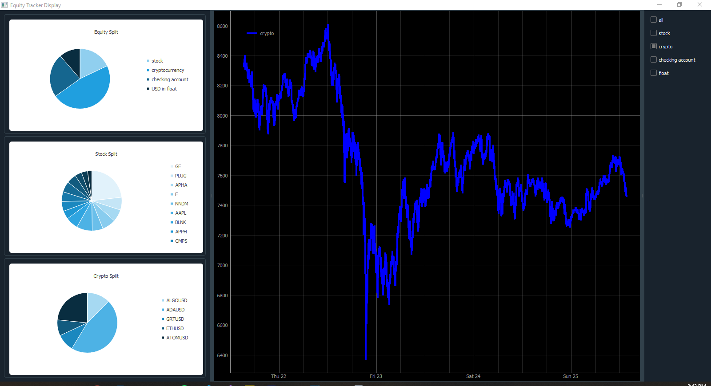

<!-- PROJECT LOGO -->
<br />
<p align="center">
  <a href="https://github.com/jtcass01/Stocker">
    
  </a>

  <h3 align="center">Status Logger</h3>

  <p align="center">
    Application designed to keep track of checking account, stock, and crypto investments in real time.
    <br />
    <a href="https://github.com/jtcass01/Stocker"><strong>Explore the docs »</strong></a>
    <br />
    <br />
    <a href="https://github.com/jtcass01/Stocker/issues">Report Bug</a>
    ·
    <a href="https://github.com/jtcass01/Stocker/issues">Request Feature</a>
  </p>
</p>


<!-- TABLE OF CONTENTS -->
<details open="open">
  <summary><h2 style="display: inline-block">Table of Contents</h2></summary>
  <ol>
    <li>
      <a href="#getting-started">Getting Started</a>
      <ul>
        <li><a href="#install-3rd-party-modules">Install 3rd Party Modules</a></li>
        <li><a href="#install-stocker">Install Stocker</a></li>
      </ul>
    </li>
    <li><a href="#usage">Usage</a></li>
    <li><a href="#contributing">Contributing</a></li>
    <li><a href="#license">License</a></li>
    <li><a href="#contact">Contact</a></li>
  </ol>
</details>


<!-- GETTING STARTED -->
## Getting Started
- Clone the repo
```Bash
git clone https://github.com/jtcass01/Stocker.git
```

### Install 3rd Party Modules
- StatusLogger

Follow the instructions listed [here](https://github.com/jtcass01/StatusLogger#getting-started).

- PyQt5
```bash
pip install PyQt5
```

- pyqtgraph
```bash
pip install pyqtgraph
```

- pyqtchart
```bash
pip install pyqtchart
```

- qdarkstyle
```bash
pip install qdarkstyle
```

- NumPy
```bash
pip install numpy
```

- Pandas
```bash
pip install pandas
```

- Binance API
```bash
pip install python-binance
```

- Coinbase API
```bash
pip install coinbase
```

- Yahoo Finance Stock API
```bash
pip install yahoo-fin
```

## Usage
This project is still in the early stages of development.  Since data like stock holdings and crypto holdings are currently static and held in encrypted files not included in this repository; it is not likely this application can be used by anyone without reverse engineering quite a bit of the code.  It surely won't run as is.  If you are interested in the schema for resource files to edit this application to track your investments; please reach out.

### Equity Tracker Display Current State



<!-- CONTRIBUTING -->
## Contributing

Contributions are what make the open source community such an amazing place to be learn, inspire, and create. Any contributions you make are **greatly appreciated**.

1. Fork the Project
2. Create your Feature Branch (`git checkout -b feature/AmazingFeature`)
3. Commit your Changes (`git commit -m 'Add some AmazingFeature'`)
4. Push to the Branch (`git push origin feature/AmazingFeature`)
5. Open a Pull Request

<!-- LICENSE -->
## License

Distributed under the GPL-3.0 License. See `LICENSE` for more information.


<!-- CONTACT -->
## Contact

Jacob Taylor Cassady - [@Jacob_Cassady](https://twitter.com/Jacob_Cassady) - jacobtaylorcassady@outlook.com

Project Link: [https://github.com/jtcass01/StatusLogger](https://github.com/jtcass01/StatusLogger)
